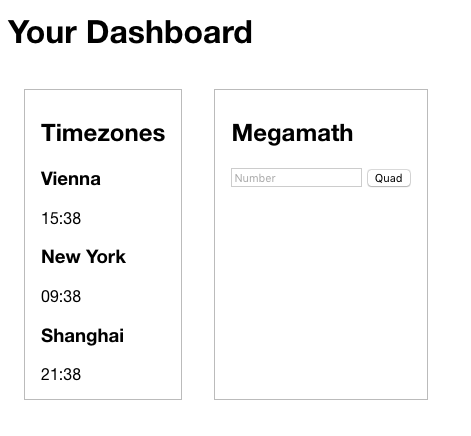

# ES 6 Modules: Dashboard

A quick example how to create, bundle and load ES 6 modules with [jspm](jspm.io).
The result is a dashboard, containing 2 self-written modules where one is making use of [Moment Timezone](http://momentjs.com/timezone/) to demonstrate the usage of npm modules.

## Requirements

- [node.js](http://nodejs.org/)

## Installation

- clone this repository
- cd into the projects root dir
- `npm install`
- `jspm install`

To serve the project the quickest and certainly most elegant way is jspm-server:
- `npm install -g jspm-server` 
- Execute `jspm-server` in the projects root dir to serve

## Create bundle for production

For now, SystemJS will transpile on-the-fly which should be avoided in production. You can create a production-ready bundle with the following command:

- `jspm bundle app/scripts/app.js bundle.js`

Once the `bundle.js` exists, it will be used and changes in your modules won't be hot-reloaded by the jspm-server.
